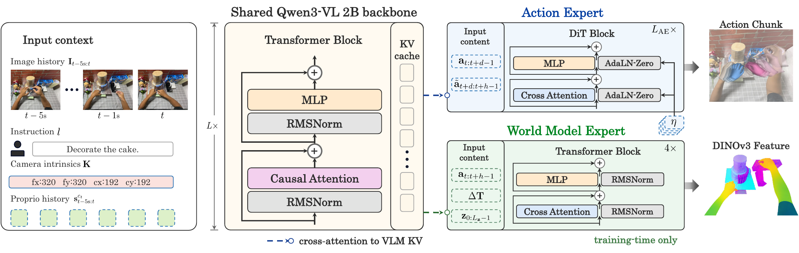
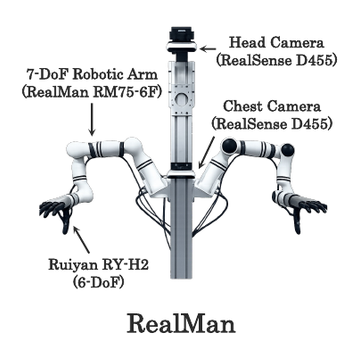
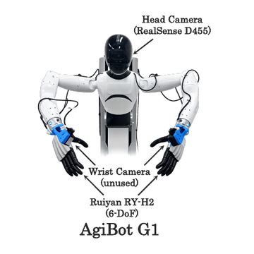

<h1 align="center">EgoSteer: A Full-Stack System Towards Steerable Dexterous Manipulation from Egocentric Videos</h1>

<p align="center">
  <a href="https://github.com/egosteer/egosteer"></a>
  <a href="https://egosteer.github.io/"></a>
  <a href="https://huggingface.co/datasets/egosteer"></a>
  <a href="https://huggingface.co/EgoSteer/models"></a>
</p>

<p align="center">
  <a href="https://github.com/egosteer/egosmith"></a>
  <a href="https://github.com/egosteer/robot-stack"></a>
  <a href="https://github.com/egosteer/egosteer"></a>
</p>

<p align="center">
  
</p>

Our **full-stack system** integrates [EgoSmith](https://github.com/egosteer/egosmith), [Robot Stack](https://github.com/egosteer/robot-stack), and [EgoSteer](https://github.com/egosteer/egosteer) (this repo) to learn from large-scale egocentric human videos and facilitate data-efficient real-robot post-training, enabling steerable dexterous manipulation across over 40 tasks alongside few-shot adaptation to complex, long-horizon tasks.

This repository contains **EgoSteer**, a **world-model-enhanced** Vision-Language-Action (VLA) policy built on a Qwen3-VL backbone with a flow-matching action expert. It provides a complete pipeline for training, evaluating, and serving the policy, runs on the RealMan robot out of the box, and easily extends to other embodiments.

<p align="center">
  
</p>

## Installation

Clone the repository first, then set up an environment for training or inference:

```bash
git clone https://github.com/egosteer/egosteer.git
cd egosteer
```

### Full Training Environment

```bash
bash scripts/install.sh   # In the "Add NVIDIA repository" step, pick the entry matching your OS.
```

The installation script sets up system dependencies, a Python 3.10 conda environment, PyTorch with CUDA 12.8, FlashAttention, and other Python packages required for training and inference.

### Minimal Inference Environment

To host a policy server only, you can manually set up the environment. Packages like pdsh and numactl are not required; use the commands below to install a minimal environment:

```bash
conda create -y -n egosteer python=3.10
conda activate egosteer

pip install torch==2.10.0+cu128 torchvision==0.25.0+cu128 torchaudio==2.10.0+cu128 --extra-index-url https://download.pytorch.org/whl/cu128

pip install packaging ninja psutil
MAX_JOBS=2 pip install flash-attn --no-build-isolation
pip install -r requirements.txt
```

You can also get this environment from Docker instead of conda; see [Docker Environment](#docker-environment) under Deployment.

## Pretrained Weights

EgoSteer is built on two pretrained models, Qwen3-VL-2B and DINOv3, which are required for training and inference. Download them from Hugging Face, [Qwen3-VL-2B-Instruct](https://huggingface.co/Qwen/Qwen3-VL-2B-Instruct) and [DINOv3](https://huggingface.co/facebook/dinov3-vitl16-pretrain-lvd1689m), then set each local path in the configs below.

Set the **Qwen3-VL-2B-Instruct** path in:

- `pretrained.model_name_or_path` in [qwen3_vl_2b.yaml](src/config/model/qwen3_vl_2b.yaml)
- `policy.pretrained_vlm_path` in [inference.yaml](src/config/experiment/inference.yaml)

Set the **DINOv3** path in:

- `world_model.frozen_teacher.model_name_or_path` in [frozen_regression.yaml](src/config/world_model/frozen_regression.yaml)
- `policy.teacher_path` in [inference.yaml](src/config/experiment/inference.yaml)

We also release the trained EgoSteer models below. Use **EgoSteer-3B-Base** as the base for fine-tuning on your own data, and **EgoSteer-3B-RealMan** for off-the-shelf deployment on the RealMan robot.

| Model Type | Model Name | Parameters | Description |
|------------|------------|------------|-------------|
| **EgoSteer Pretrained** | [EgoSteer-3B-Base](https://huggingface.co/EgoSteer/EgoSteer-3B-Base) | 3B | Base EgoSteer model trained on 9.6k hours of egocentric human videos, ready for fine-tuning |
| **EgoSteer Generalist** | [EgoSteer-3B-RealMan](https://huggingface.co/EgoSteer/EgoSteer-3B-RealMan) | 3B | A generalist model post-trained on real-world data collected on the RealMan robot |

## Quick Start

The fastest way to verify your setup is to train on the small example dataset.

**1. Download and unpack the example data** at the repository root. The package
is hosted on [Google Drive](https://drive.google.com/file/d/1iBPKZrHYjw3kmC0XYHfj7mpcElmBtCBR/view?usp=sharing)
and contains both VLA and VLM dataset shards. It ships no normalizer, so you
compute it in step 2. Quick Start trains on the VLA shards only. For the VLM
data format and how to enable VLA + VLM joint training, see [`data.md`](data/data.md).

```bash
# Option A: Command Line (gdown handles the Google Drive confirmation step)
pip install gdown
gdown 1iBPKZrHYjw3kmC0XYHfj7mpcElmBtCBR -O example_data.zip

# Option B: Manual Download
# Download "example_data.zip" manually from the link above, 
# and place it at the repository root.

# Unpack the dataset (required for both options)
unzip -q example_data.zip
```

This unpacks to:

```text
example_data/
├── vla/
│   ├── train/shard-*.tar
│   └── val/shard-*.tar
└── vlm/
    ├── train/shard-*.tar
    └── val/shard-*.tar
```

**2. Compute the state/action normalizer** from the shards:

```bash
bash scripts/compute_norm_stats.sh
#    -> outputs/normalizer/example/normalizer.pkl
#    -> outputs/normalizer/example/normalizer.json
```

**3. Launch single-node training.** The default config already points at
`example_data/` and the normalizer above, so no further edits are needed. Make
sure the Qwen3-VL / DINOv3 paths from [Pretrained Weights](#pretrained-weights)
are set:

```bash
bash scripts/train_egosteer_fsdp2_single_node.sh
```

The script launches [train.py](train.py) through `torchrun`, sets the distributed
environment variables, and uses [numa_bind_wrapper.sh](scripts/numa_bind_wrapper.sh) when applicable.

**4. Monitor on Weights & Biases.** Training logs losses, learning rates, and eval metrics such as `eval/l1_loss` to [Weights & Biases](https://wandb.ai), under the project and entity set in [logging/default.yaml](src/config/logging/default.yaml). Run `wandb login` first, or set `logging.mode: offline` to turn it off.

## Fine-tuning with Your Own Data

To adapt EgoSteer to your own data or embodiment, fine-tune from the released
**EgoSteer-3B-Base** weights.

**1. Prepare your data and normalizer.** Convert your data to the EgoSteer
WebDataset format and compute a normalizer over it. See [`data.md`](data/data.md)
for the shard/sample layout, coordinate conventions, and conversion guide. Then
point the shard paths in [vla_wds.yaml](src/config/dataset_paths/vla_wds.yaml) to
your data, and compute the normalizer:

```bash
bash scripts/compute_norm_stats.sh   # writes outputs/normalizer/example/normalizer.pkl
```

In general, fine-tuning uses a normalizer fitted to *your* data rather than the
released one. The exception is when the target robot is a humanoid whose
embodiment gap from humans is small: because the action space is the unified
human-to-robot representation, you can then reuse the pre-computed normalizer
directly and skip [compute_norm_stats.sh](scripts/compute_norm_stats.sh). The pre-computed normalizer is provided 
alongside **EgoSteer-3B-Base** in the same Hugging Face repository as `normalizer.pkl`.

**2. Download the base model.** Get `model_bf16.pt` for [EgoSteer-3B-Base](https://huggingface.co/EgoSteer/EgoSteer-3B-Base) from
Hugging Face.

**3. Configure the run.** In [default.yaml](src/config/training/default.yaml):

```yaml
training:
  finetune_checkpoint_path: /path/to/model_bf16.pt        # the downloaded EgoSteer-3B-Base weights
  normalizer_path: /path/to/your/normalizer.pkl
```

EgoSteer trains on an infinite WebDataset stream, so run length is measured in optimizer update steps rather than data epochs. The same `training` section also sets the run length, learning-rate schedule, evaluation interval, and checkpoint interval; follow the inline comments there.

**4. Launch training.**

```bash
# Single node
bash scripts/train_egosteer_fsdp2_single_node.sh
```

For a manually managed multi-node cluster, edit the node list and network
settings in [train_egosteer_fsdp2.sh](scripts/train_egosteer_fsdp2.sh), then launch from the master node:

```bash
# Multi node
bash scripts/train_egosteer_fsdp2.sh
```

Passwordless SSH must be configured across all nodes; the launcher uses `pdsh`
over SSH to start one `torchrun` worker group per node, each node must share 
identical source paths, Python environments, data directories, and checkpoint storage.

On a container-cloud platform (e.g., Volcano, Tencent Cloud), use
[train_egosteer_fsdp2_cloud.sh](scripts/train_egosteer_fsdp2_cloud.sh) instead. This script is launched once
inside the container of **each** node and reads the multi-node topology from
environment variables the platform injects, so no SSH fan-out is needed. These
variables specify the master address/port, node rank, node count, and GPUs per node. Before using it,
edit the `XXX_*` variable names near the top of the script to match the ones
your platform actually exports, then set it as the container start command:

```bash
# Run inside every node's container (platform sets the topology env vars)
bash scripts/train_egosteer_fsdp2_cloud.sh
```

### Resuming Training

To resume an interrupted run from one of its own DCP checkpoint directories,
set the following in [default.yaml](src/config/training/default.yaml):

```yaml
training:
  resume: true
  resume_checkpoint_path: /path/to/checkpoint        # a DCP checkpoint directory
```

Unlike fine-tuning, resuming restores the full training state, namely the model,
optimizer, LR schedule, and step counter, so the run continues exactly where it stopped.

### Checkpoint Layout

Each training run writes outputs to a Hydra run directory. The saved
`.hydra/config.yaml` in that same directory is the training config used by
evaluation and serving.

```text
outputs/<date>/<time>_<name>_<experiment>/
├── .hydra/
│   ├── config.yaml              # pass this to eval / serving as the training config
│   ├── hydra.yaml
│   └── overrides.yaml
├── checkpoints/
│   └── update_step=10000/       # top-k DCP checkpoint directory
│       ├── .metadata
│       └── __*_*.distcp
├── step_checkpoints/
│   └── update_step_10000/       # periodic DCP checkpoint directory
│       ├── .metadata
│       └── __*_*.distcp
└── ...
```

Use the checkpoint directory itself as `checkpoint_path`, not an individual file inside it.

## Deployment

For real-robot inference, EgoSteer runs as a **WebSocket policy server**: it
loads the policy and returns action chunks for incoming observations. The
robot-side client lives in the [Robot Stack](https://github.com/egosteer/robot-stack)
repository. It captures camera/state observations, streams them to the server, and
executes the returned actions on hardware. A full
deployment uses **both**: the policy server described below and the Robot Stack
controller talking to it.

The hardware platforms used for dexterous manipulation are shown below.

<p align="center">
  
  
</p>

All serving configuration lives in [inference.yaml](src/config/experiment/inference.yaml); edit
the fields there following their inline comments. We provide two ways to serve the
policy: directly from a local checkout, or from a Docker environment container
that mounts a local checkout.

### Native Serving

Edit the `EDIT` fields in `inference.yaml`, then launch the WebSocket policy
server from a local checkout:

```bash
bash scripts/run_server.sh
```

### Docker Environment

The Docker image contains the inference environment: CUDA, PyTorch, and
the Python/system dependencies. Run it from a local checkout so
`create_container.sh` can mount this repository into the container, matching the
workflow used by the robot stack.

```bash
git clone https://github.com/egosteer/egosteer.git
cd egosteer

# Pull the prebuilt environment image:
docker pull egosteerai/inference-server:latest

./create_container.sh egosteer ./egosteer-checkpoints

# Inside the container:
bash scripts/run_server.sh
```

You can also build docker from `Dockerfile` with `docker build -t egosteerai/inference-server:1.0.0 -t egosteerai/inference-server:latest .`

The checkpoint root passed as the second argument is mounted to
`/root/workspace/checkpoints` inside the container. A typical serving layout is:

```text
egosteer-checkpoints/
  egosteer-realman/
    config.yaml
    model_bf16.pt
    normalizer-relative-10k-pretrain/
      normalizer.pkl
  Qwen3-VL-2B-Instruct/
    ...
  dinov3-vitl16-pretrain-lvd1689m/
    ...
```

With this standard layout the container needs **no extra configuration**. If
your bundle uses a different layout, edit the paths in
[inference.yaml](src/config/experiment/inference.yaml) directly before starting
the server.

The container starts as a long-running environment shell with this repository
mounted at `/root/workspace/egosteer`. Because the container uses host
networking, no Docker port mapping is needed. To choose a different port, edit
`serving.port` in [inference.yaml](src/config/experiment/inference.yaml) before
starting the server.

## Evaluation

Offline evaluation is configured by [eval_config.yaml](src/config/eval_config.yaml).

```bash
bash scripts/run_eval.sh <checkpoint_path> <train_config_path>
```

Example:

```bash
bash scripts/run_eval.sh \
    outputs/<your-run>/checkpoints/update_step=10000 \
    outputs/<your-run>/.hydra/config.yaml
```

The second argument is the `config.yaml` saved by Hydra in the same training output directory as the checkpoint. For example, a checkpoint under `outputs/<your-run>/checkpoints/update_step=10000/` should normally use `outputs/<your-run>/.hydra/config.yaml`.

Evaluation computes action metrics and can generate a self-contained HTML report with visual overlays.

## Acknowledgements

EgoSteer builds on a number of excellent open-source projects, and we thank their authors and communities.

**Third-party code:**

- [openpi](https://github.com/Physical-Intelligence/openpi)
- [diffusion_policy](https://github.com/real-stanford/diffusion_policy)
- [Hugging Face Transformers](https://github.com/huggingface/transformers)
- [PyTorch3D](https://github.com/facebookresearch/pytorch3d)
- [transforms3d](https://github.com/matthew-brett/transforms3d)
- [TorchTitan](https://github.com/pytorch/torchtitan)
- [TorchTNT](https://github.com/pytorch/tnt)
- [kornia](https://github.com/kornia/kornia)
- [pytorch_HMR](https://github.com/MandyMo/pytorch_HMR)

**Pretrained models & assets:**

- [Qwen3-VL](https://github.com/QwenLM/Qwen3-VL)
- [DINOv3](https://github.com/facebookresearch/dinov3)

See [NOTICE](NOTICE) for the full copyright and license notices.

## Citation

If you find EgoSteer useful in your research, please consider citing:

```bibtex
@article{egosteer2026,
  title   = {EgoSteer: A Full-Stack System Towards Steerable Dexterous Manipulation from Egocentric Videos},
  author  = {EgoSteer Team},
  journal = {arXiv preprint arXiv:XXXX.XXXXX},
  year    = {2026},
}
```
