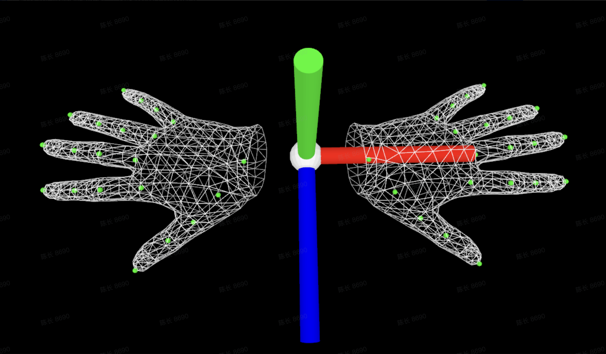

# Data

This document describes the EgoSteer data format and how to convert your own
data into it. To train on the small example dataset first, see the
[Quick Start](../README.md#quick-start) in the main README.

## Dataset format

EgoSteer stores data **per episode**. An episode's frames are written as consecutive samples at a fixed rate of **30 fps**, and every frame of an episode is kept inside a **single `.tar` shard**. The loader streams frames in this stored order and cuts the temporal training windows at episode boundaries keyed by `episode_index`, so preserving this per-episode contiguity is required.

### Shard and sample layout

Each subset is a directory of `.tar` shards. WebDataset groups all members that share the **same key prefix**, the text before the first dot, into one frame-level sample.

```text
example_data/vla/train/
├── shard-000000.tar
├── shard-000001.tar
└── ...

# Members of one frame sample, grouped by the shared key prefix
episode_000123_frame_000045.image.jpg          # head RGB
episode_000123_frame_000045.depth.npy          # head depth, optional
episode_000123_frame_000045.chest_image.jpg    # chest RGB, only with dual cameras
episode_000123_frame_000045.chest_depth.npy    # chest depth, only with dual cameras
episode_000123_frame_000045.lowdim.npy         # state/action + per-camera params
episode_000123_frame_000045.meta.json          # text + other metadata
```

The `chest_*` members exist only in dual-camera real-robot data; the default head-only sample omits them, and `depth.npy` is optional in either case.

### `lowdim.npy` layout

A 1-D `float32` array per frame. The first **96** dims are fixed; each declared camera then appends a **20**-dim block of `extrinsic` 16 plus `intrinsic` 4, in `meta["cameras"]` order.
Head-only is **116** dims; head + chest is **136**.

| Range | Field | Dim | Content |
|---|---|---|---|
| `0:18` | `wrist_state` | 18 | `[left_trans(3), right_trans(3), left_rot6d(6), right_rot6d(6)]`, **world frame**. `rot6d` = the first two columns of the 3×3 wrist→world rotation matrix. |
| `18:48` | `hand_state` | 30 | `[left_hand(15), right_hand(15)]`. Each hand = 5 fingertip `xyz` points, ordered thumb, index, middle, ring, pinky, **world frame**. |
| `48:66` | `wrist_action` | 18 | Next-frame `wrist_state`, same layout. |
| `66:96` | `hand_action` | 30 | Next-frame `hand_state`, same layout. |
| `96:112` | `extrinsic` | 16 | Head camera. Row-major flattened 4×4 homogeneous **world→camera** matrix. |
| `112:116` | `intrinsic` | 4 | Head camera. `[fx, fy, cx, cy]`. |
| `116:132` | `chest_extrinsic` | 16 | Chest camera, dual-camera data only. **World→camera** matrix, row-major flattened 4×4. |
| `132:136` | `chest_intrinsic` | 4 | Chest camera, dual-camera data only. `[fx, fy, cx, cy]`. |

### `meta.json` fields

| Field | Required | Content |
|---|---|---|
| `instruction` | **yes** | Task text: a `str`, or a `list[str]` of candidates. |
| `instruction_num` | **yes** | Number of candidate instructions; must be `> 0`. |
| `episode_index` | **yes** | Episode id. Frames sharing the same `dataset_name` and `episode_index` must be **contiguous and in temporal order** within a shard. |
| `dataset_name` | optional, default `""` | Dataset name; combined with `episode_index` to key episodes. |
| `cameras` | optional, default `["head"]` | Cameras present in this sample, in the same order as the per-camera blocks in `lowdim.npy`. **`cameras[0]` must be `"head"`.** |
| `presence` | deprecated | Hand-presence flag for human data: `0` none, `1` left, `2` right, `3` both. |
| `high_quality` | optional, default `1` | DAgger flag: `1` = human-intervention frame, `0` = robot-execution frame. |

---

## Build your own dataset

To train on your own data, emit WebDataset shards that satisfy the contract above. You do not
need any EgoSteer-specific tooling — any script that writes `.tar` shards works, for example
the `webdataset` library's `ShardWriter`.

**Producer steps**

1. For each frame, write members under a shared key prefix:
   - `image.jpg` — head RGB, `uint8`
   - `lowdim.npy` — the `float32` array laid out as in [`lowdim.npy` layout](#lowdimnpy-layout)
   - `meta.json` — at least `instruction`, `instruction_num`, `episode_index`
   - `depth.npy` — optional head depth, `uint16` mm
   - `chest_image.jpg` / `chest_depth.npy` — optional, for dual-camera data
2. Pack frames into `.tar` shards in **episode-contiguous, temporal order**.
3. Point the `wds_base_dir` and `shard_urls` entries in [vla_wds.yaml](../src/config/dataset_paths/vla_wds.yaml) at your shards.

**Coordinate conventions: these must match exactly**

<p align="center">
  
</p>

`wrist_*` and `hand_*` are in the **world frame**. The axis convention is shown in the figure above, where the red, green, and blue axes correspond to the x, y, and z axes respectively; see the [EgoSmith](https://github.com/egosteer/egosmith) repository for the full convention.

**Validation skips and logs bad samples**

The loader runs per-sample sanity checks in [sanity_checks.py](../src/dataset/sanity_checks.py) and **drops** failing frames, logging each skip to stdout under the `DATA_SKIP` tag. If valid-sample throughput is unexpectedly low, check the logs. Thresholds are configurable under `data.sanity_checks` in [unified_wds.yaml](../src/config/data/unified_wds.yaml).

**Adding a chest camera**

Add a `chest_image.jpg` member; append the chest
`extrinsic` and `intrinsic` blocks to `lowdim.npy`; set `meta["cameras"]` to `["head", "chest"]`; and enable loading with `dataset.vla_dataset.load_chest=True` in [unified_wds.yaml](../src/config/data/unified_wds.yaml). Each extra camera adds one more image per frame, so a head and chest sample carries roughly twice the vision tokens of a head-only one. Raise `data.max_vlm_tokens` accordingly, and lower `dataloader.loader.batch_size` so the larger per-sample token count still fits in GPU memory.

**Changing the image resolution**

To change the image resolution, set `data.target_image_size` in [unified_wds.yaml](../src/config/data/unified_wds.yaml) to the desired `[W, H]`, or `null` to keep the original resolution. A higher resolution means more vision patches per image, so it raises the per-sample token count just as an extra camera would. After changing it, adjust `data.max_vlm_tokens` and `dataloader.loader.batch_size` to match.

---

## Normalizer

Training requires a precomputed state/action normalizer. The example package ships none, so compute it after unpacking the shards:

```bash
bash scripts/compute_norm_stats.sh
```

By default this writes:

```text
outputs/normalizer/example/
├── normalizer.pkl
└── normalizer.json
```

Then set `training.normalizer_path` in [default.yaml](../src/config/training/default.yaml):

```yaml
training:
  normalizer_path: outputs/normalizer/example/normalizer.pkl
```

---

## VLA + VLM joint training

The code supports joint VLA + VLM training. It is **disabled by default**, with `vlm_dataset: null` and `vla_ratio: 1` in [unified_wds.yaml](../src/config/data/unified_wds.yaml). The example package also ships VLM shards under `example_data/vlm/`, so you can turn it on.

### VLM data format

VLM shards use the same WebDataset key-prefix grouping as VLA, but each sample is an image and text QA frame with no `lowdim.npy`:

```text
example_data/vlm/train/
├── shard-000000.tar
└── ...

# Members of one VLM sample, grouped by the shared key prefix
sample_000123.image_0.jpg     # RGB image; use image_0, image_1, ... for multiple images
sample_000123.meta.json       # candidate QA turns + per-candidate ratings
```

`meta.json` fields (all required):

| Field | Content |
|---|---|
| `texts` | List of candidate QA turns; each turn is `{"user": <question>, "assistant": <answer>}`. |
| `formatting_ratings` | Score for answer formatting, one per candidate turn; `null` counts as 0. |
| `visual_dependency_ratings` | Score for how much the answer relies on the image, one per candidate turn. |
| `relevance_ratings` | Score for answer relevance, one per candidate turn. |

These three `*_ratings` are per-turn quality scores carried over from [FineVision](https://huggingface.co/datasets/HuggingFaceM4/FineVision); see it for the exact rating criteria. When `texts` holds more than one candidate, the loader keeps the turn with the highest weighted score `formatting * w0 + visual_dependency * w1 + relevance * w2`. The weights default to `[0.5, 0.5, 0.5]` and are set via the dataset's `weights`.

### Enabling joint training

1. Add VLM shard entries to `vlm_wds_datasets` and `val_vlm_wds_datasets` in [vlm_wds.yaml](../src/config/dataset_paths/vlm_wds.yaml), using the same `name` / `shard_urls` / `weight` schema as VLA:

   ```yaml
   vlm_wds_datasets:
     - name: example_vlm
       shard_urls: example_data/vlm/train/shard-*.tar
       weight: 1
   val_vlm_wds_datasets:
     - name: example_vlm_val
       shard_urls: example_data/vlm/val/shard-*.tar
   ```

2. In [unified_wds.yaml](../src/config/data/unified_wds.yaml), set `dataset.vlm_dataset` to a `VLMWdsDataset` block and lower `vla_ratio` below `1`. Then `round(batch_size * vla_ratio)` samples per batch are VLA and the rest are VLM:

   ```yaml
   dataset:
     vlm_dataset:
       _target_: src.dataset.vlm_dataset.VLMWdsDataset
       wds_datasets: ${vlm_wds_datasets}
       val_wds_datasets: ${val_vlm_wds_datasets}
       weights: [0.5, 0.5, 0.5]
       target_image_size: ${data.target_image_size}
       shuffle_buffer: 16384
       shuffle_initial: 4096
       sanity_checks: ${data.sanity_checks}
     vla_ratio: 0.8
   ```
