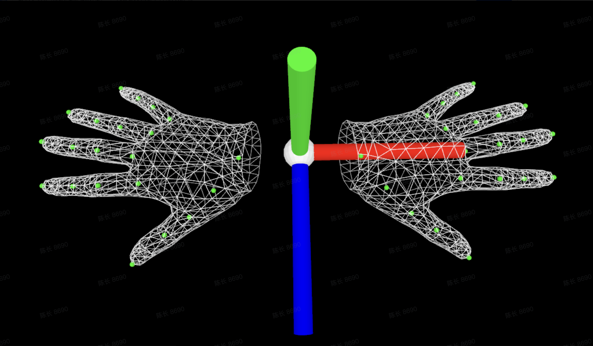

# LeRobot Data

This document describes the EgoSteer LeRobot v3 data format and how to prepare
your own dataset. For training commands, see
[Fine-tuning with Your Own Data](../README.md#fine-tuning-with-your-own-data).
For WebDataset shards, see [wds.md](wds.md).

## Dataset format

EgoSteer stores data **per episode** at a fixed rate of **30 fps**. Each frame
occupies one Parquet row. RGB and depth videos are stored separately, with
their episode boundaries recorded in the episode metadata.

### File layout

```text
<root>/
├── meta/
│   ├── info.json
│   ├── tasks.parquet
│   ├── stats.json
│   └── episodes/chunk-000/file-000.parquet
├── data/
│   └── chunk-000/file-000.parquet
└── videos/
    ├── observation.images.head/chunk-000/file-000.mp4
    ├── observation.images.chest/chunk-000/file-000.mp4
    ├── observation.images.head_depth/chunk-000/file-000.mp4
    └── observation.images.chest_depth/chunk-000/file-000.mp4
```

Files follow the `data_path` and `video_path` templates in `meta/info.json`.
Each episode's Parquet rows must be contained in the data file identified by
its episode metadata. A file may contain multiple episodes.

### Frame fields

| Field | Type / shape | Content |
|---|---|---|
| `observation.state` | `float32 [74]` | Measured state, using the layout below. |
| `action` | `float32 [74]` | Recorded command in the same layout; used directly as the training target. |
| `timestamp` | `float32` | Episode-relative time in seconds: `frame_index / fps`. |
| `frame_index` | `int64` | Frame number within the episode, starting at 0. |
| `episode_index` | `int64` | Episode identifier. |
| `index` | `int64` | Global frame index: `dataset_from_index + frame_index`. |
| `task_index` | `int64` | Task identifier in `meta/tasks.parquet`. |
| `observation.camera.head_world2cam` | `float32 [16]` | Current frame's world-to-head-camera transform, row-major flattened 4×4. |
| `observation.camera.chest_world2cam` | `float32 [16]` | Current frame's world-to-chest-camera transform; read when chest loading is enabled. |
| `high_quality` | optional, default `1` | DAgger flag: `1` = human-intervention frame, `0` = model-execution frame. Scalar or single-element 0/1 or boolean values. |

Training targets read the recorded **`action`** column at each target frame
before coordinate transforms and normalization. The final frame cannot start
a training window.

### State and action layout

A 1-D `float32` array with **74** dimensions per frame.

| Range | Field | Dim | Content |
|---|---|---|---|
| `0:7` | Left arm joints | 7 | Joint angles in radians. |
| `7:14` | Right arm joints | 7 | Joint angles in radians. |
| `14:20` | Left hand joints | 6 | Normalized motor values. |
| `20:26` | Right hand joints | 6 | Normalized motor values. |
| `26:35` | Left wrist pose | 9 | `[translation(3), rot6d(6)]`, **world frame**. Translation is in metres. |
| `35:44` | Right wrist pose | 9 | Same layout, **world frame**. |
| `44:59` | Left fingertips | 15 | Five `xyz` points in metres, ordered thumb, index, middle, ring, pinky, **world frame**. |
| `59:74` | Right fingertips | 15 | Same layout and ordering, **world frame**. |

`rot6d` contains the first two columns of the wrist-to-world rotation matrix:
`[R00, R10, R20, R01, R11, R21]`. The model uses the wrist and fingertip fields
as a 48D representation; the joint fields remain part of the stored vector.

### Episode metadata

Each row in `meta/episodes/chunk-*/file-*.parquet` describes one episode.
Matrices are stored as row-major flattened arrays.

| Field | Type / shape | Content |
|---|---|---|
| `episode_index` | `int64` | Episode identifier, starting at 0. |
| `length` | `int64` | Number of frames. |
| `tasks` | `list[str]` | A single task name matching the task table. |
| `instructions` | `list[str]` | Nonempty list of candidate instructions. Training samples one uniformly; validation uses the first. |
| `dataset_from_index` / `dataset_to_index` | `int64` | Global frame interval `[from, to)`; its length equals `length`. |
| `data/chunk_index` / `data/file_index` | `int64` | Location of the episode's Parquet frame rows. |
| `calibration.head_intrinsics` / `calibration.chest_intrinsics` | `float64 [9]` | Camera intrinsic matrix, flattened 3×3. |
| `calibration.{camera}_cam_to_{side}_base` | `float64 [16]` | Camera-to-arm-base transform for each combination of `camera` = `head`, `chest` and `side` = `left`, `right`. |
| `videos/{feature}/chunk_index` / `file_index` | `int64` | Video location for each camera feature listed below. |
| `videos/{feature}/from_timestamp` / `to_timestamp` | `float64` | Episode interval in that video file, in seconds. Its duration equals `length / fps`. |

`meta/tasks.parquet` stores task names as the pandas index named `task`, with
an integer `task_index` column. Frame task identifiers must resolve to the
episode's task name.

`meta/info.json` declares `codebase_version: "v3.0"`, `fps`, `total_episodes`,
feature types and shapes, and the data/video path templates. Its `splits` field
selects **episode index intervals**, for example:

```json
{
  "splits": {
    "train": "0:80",
    "val": "80:100"
  }
}
```

### Camera features

| Feature | Shape `[H, W, C]` | Content |
|---|---|---|
| `observation.images.head` | `[480, 640, 3]` | Head RGB video. |
| `observation.images.chest` | `[480, 640, 3]` | Chest RGB video. |
| `observation.images.head_depth` | `[480, 640, 1]` | Head depth video. |
| `observation.images.chest_depth` | `[480, 640, 1]` | Chest depth video. |

Declare each feature with `dtype: "video"` in `info.json`. Each video has its
own file indices and timestamps; record RGB and depth offsets independently.
The decoded resolution and frame rate must match the metadata.

Depth uses lossless HEVC `gray12le` codes. Store `video.depth_min`,
`video.depth_max`, `video.shift`, and `video.use_log` in the feature's `info`
mapping. Decoded depth is `float32` in metres; code 0 denotes an invalid pixel
and decodes to zero.

---

## Build your own dataset

Prepare a LeRobot v3 dataset with the fields above.

**Producer steps**

1. Record measured states and synchronized camera frames at 30 fps.
2. Write frame rows with continuous episode-local and global indices.
3. Write episode metadata, calibration, task names, and candidate instructions.
4. Record each video's file location and episode timestamps independently.
5. Set the dataset root and split names in [vla_lerobot.yaml](../src/config/dataset_paths/vla_lerobot.yaml).

**Coordinate conventions: these must match exactly**

<p align="center">
  
</p>

Wrist poses and fingertips are in a shared **world frame**. The red, green,
and blue axes in the figure correspond to x, y, and z. Frame-level camera
extrinsics transform world coordinates into each frame's camera coordinates;
homogeneous transforms act on column vectors. See
[EgoSmith](https://github.com/egosteer/egosmith) for the coordinate convention.

Each window uses its anchor frame's camera pose. Future-frame supervision uses
the poses from the corresponding future rows, including repeated tail frames.
Single-camera loading reads head poses only; dual-camera loading reads both.
World-to-camera transforms are read from frame rows, not episode metadata.

**Validation skips and logs bad samples**

Per-sample sanity checks in [sanity_checks.py](../src/dataset/sanity_checks.py)
drop invalid samples and report them under the `DATA_SKIP` tag. Thresholds are
configured under `data.sanity_checks` in
[unified_lerobot.yaml](../src/config/data/unified_lerobot.yaml).
Malformed files or inconsistent frame indices are reported as errors.

**Adding a chest camera**

Provide the chest camera features and calibration fields, then enable
`dataset.vla_dataset.load_chest` in
[unified_lerobot.yaml](../src/config/data/unified_lerobot.yaml).
Enable `dataset.vla_dataset.load_depth` to read depth videos. An additional
RGB camera increases the vision token count; adjust `data.max_vlm_tokens` and
`dataloader.loader.batch_size` accordingly.

**Changing the image resolution**

Set `data.target_image_size` in
[unified_lerobot.yaml](../src/config/data/unified_lerobot.yaml) to the desired
**`[H, W]`**, for example `[480, 640]` for a 640×480 image. RGB uses bilinear
resize, depth uses nearest-neighbor resize, and camera intrinsics scale with
the image dimensions. Adjust the token budget and batch size for larger images.

---

## Normalizer

Training requires a precomputed state/action normalizer. Compute it from the
training split after preparing the dataset:

```bash
python -m src.workspace.compute_lerobot_norm_stats \
  --output_dir outputs/normalizer/lerobot \
  lerobot_root=/path/to/lerobot_dataset
```

This writes:

```text
outputs/normalizer/lerobot/
├── normalizer.pkl
└── normalizer.json
```

Set the path in your training configuration:

```yaml
training:
  normalizer_path: outputs/normalizer/lerobot/normalizer.pkl
```

Use the same data and motion configuration for normalizer computation and
training. `meta/stats.json` contains raw dataset statistics; training uses the
model-space normalizer above.
